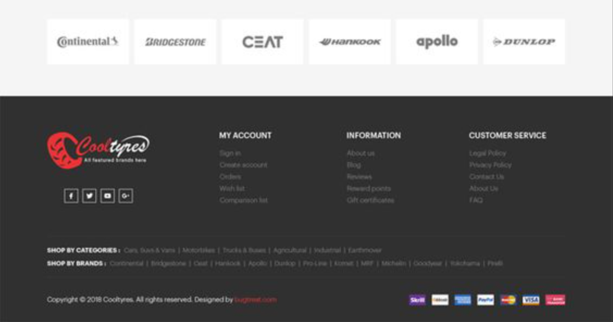

# Neumaticos-Meliton-React

Neumáticos Melitón es un proyecto orientado a la venta de neumáticos para una pequeña empresa llamada Neumáticos Melitón. El objetivo principal es proporcionar una plataforma en línea para que los clientes puedan comprar neumáticos de manera conveniente y eficiente.

# Características
El proyecto incluye las siguientes secciones:

- **Shoop**: Una sección donde los usuarios pueden explorar y comprar neumáticos disponibles.
- **Admin**: Un panel de administración para gestionar productos, pedidos y usuarios.
- **Ofertas**: Una sección donde se muestran las ofertas y promociones disponibles.
- **Rendición de ventas y stock**: Funcionalidades para generar informes de ventas y gestionar el inventario.
- **About Us**: Una página que describe la empresa Neumáticos Melitón y su historia.
- **Detalles de usabilidad**: Se incluyen detalles diseñados para mejorar la experiencia de uso de la aplicación para los usuarios.

## Herramientas

- **Material-UI**: Una librería de componentes de interfaz de usuario para React basada en Material Design.
- **React**: Una biblioteca de JavaScript para construir interfaces de usuario.
- **Sequelize**: Un ORM (Object-Relational Mapping) para Node.js que se utiliza con bases de datos SQL.
- **PostgreSQL**: Un sistema de gestión de bases de datos relacional de código abierto y potente.
- **JavaScript**: El lenguaje de programación principal utilizado para el desarrollo del lado del cliente y del servidor.
- **CSS**: El lenguaje de estilos utilizado para dar formato y diseñar la interfaz de usuario.
- **Tailwind CSS**: Un framework de CSS utilitario para crear rápidamente diseños personalizados.
- **Auth Google**: Autenticación utilizando el servicio de autenticación de Google.
- **JWT (JSON Web Token)**: Un estándar abierto (RFC 7519) que define una forma compacta y autónoma para transmitir información de forma segura entre las partes como un objeto JSON.
- **SweetAlert**: Una biblioteca de JavaScript para crear fácilmente ventanas modales personalizadas y atractivas.
  

    
    
    

